# ResponsiMobile1_Abhirama-Rizqi_Shift-A

# Mobile Programming Practical - Responsi 1

**Name:** Abhirama Rizqi Pratama  
**NIM:** H1D022099  
**New Shift:** A  
**KRS Shift:** D

## Table of Contents
1. [Register](#1-register)
2. [Login](#2-login)
3. [Home / Review Detail](#3-home--review-detail)
4. [Create Review](#4-create-review)
5. [Read / Show](#5-read--show)
6. [Update](#6-update)
7. [Delete](#7-delete)

## 1. Register

Code for registration:

```dart
_api.post(ApiUrl.registrasi, {
  'nama': _namaTextboxController.text,
  'email': _emailTextboxController.text,
  'password': _passwordTextboxController.text,
}).then((response) {
  final registration = Registration.fromJson(response);
  if (registration.isSuccessful) {
    showDialog(
      context: context,
      barrierDismissible: false,
      builder: (BuildContext context) => SuccessDialog(
        description: "Registrasi berhasil, silahkan login",
        okClick: () {
          Navigator.pop(context);
          Navigator.pop(context);
        },
      ),
    );
  }
  // ... (remaining code)
});
```

Note: There was an error in documentation, but the user successfully registered.

## 2. Login

Code for login:

```dart
_api.post(ApiUrl.login, {
  'email': _emailTextboxController.text,
  'password': _passwordTextboxController.text,
}).then((response) async {
  final login = Login.fromJson(response);
  if (login.isSuccessful) {
    await UserInfo().setToken(login.token ?? '');
    if (login.userId != null) {
      await UserInfo().setUserId(login.userId!);
      await UserInfo().setUserEmail(login.userEmail ?? '');
      Navigator.pushReplacement(context,
          MaterialPageRoute(builder: (context) => ReviewDetail()));
    } else {
      _showWarningDialog("Data pengguna tidak valid");
    }
  } else {
    _showWarningDialog("Login gagal: ${login.data ?? 'Terjadi kesalahan'}");
  }
  // ... (remaining code)
});
```

Note: There was no dialog, but the user successfully entered the home page.

## 3. Home / Review Detail

Code to fetch data from API:

```dart
try {
  final response = await _api.get(ApiUrl.baseUrl + '/ulasan');
  developer.log('Raw API Response: ${response.toString()}');
  developer.log('API Response: $response');
  if (response is List) {
    setState(() {
      reviews = List<Map<String, dynamic>>.from(response.map((item) {
        if (item is Map<String, dynamic>) {
          return {
            'id': item['id'] ?? 0,
            'reviewer': item['reviewer'] ?? '',
            'rating': item['rating'] ?? 0,
            'comments': item['comments'] ?? '',
          };
        } else {
          developer.log('Invalid item in response: $item');
          return {};
        }
      }));
    });
  } else if (response is Map<String, dynamic> && response['data'] is List) {
    setState(() {
      reviews = List<Map<String, dynamic>>.from(response['data'].map((item) {
        return {
          'id': item['id'] ?? 0,
          'reviewer': item['reviewer'] ?? '',
          'rating': item['rating'] ?? 0,
          'comments': item['comments'] ?? '',
        };
      }));
    });
  }
  // ... (remaining code)
}
```

This code fetches data from the API to display in the application.

## 4. Create Review

Code for creating a review:

```dart
Future<void> _submitReview() async {
  if (_formKey.currentState!.validate() && _rating > 0) {
    try {
      final response = await _api.post(
        ApiUrl.createReview,
        {
          'reviewer': _reviewerController.text,
          'rating': _rating,
          'comments': _commentsController.text,
        },
      );
      // ... (remaining code)
    }
  }
}
```

This process creates a new review. The left side shows the review input, and the right side shows a notification of successful creation.

## 5. Read / Show

The code for reading/showing reviews is similar to the home page or dashboard section, as it's essentially the same page. After submitting a review, the page refreshes.

## 6. Update

Code for updating a review:

```dart
Future<void> _updateReview() async {
  if (_formKey.currentState!.validate()) {
    try {
      final updateData = {
        'reviewer': _reviewerController.text,
        'rating': _rating,
        'comments': _commentsController.text,
      };

      developer.log('Update URL: ${ApiUrl.updateReview(widget.review['id'])}');
      developer.log('Update Data: $updateData');
      final response = await _api.put(
        ApiUrl.updateReview(widget.review['id']),
        updateData,
      );
      developer.log('Update Response: $response');
      _showSuccessDialog();
    } catch (e) {
      developer.log('Error updating review: $e');
      _showWarningDialog("Terjadi kesalahan: ${e.toString()}");
    }
  }
}
```

This update is performed when the user taps the pencil icon on the home page.

## 7. Delete

Code for deleting a review:

```dart
Future<void> deleteReview(int id) async {
  try {
    await _api.delete(ApiUrl.deleteReview(id));
    setState(() {
      reviews.removeWhere((review) => review['id'] == id);
    });
  } catch (e) {
    developer.log('Error in deleteReview: $e');
    _showWarningDialog("Terjadi kesalahan: ${e.toString()}");
  }
}
```

When the trash can icon is tapped, it will delete the available review.

## Side Menu

Used for logout functionality.

## Tangkapan Layar

<div style="display: flex; justify-content: space-between; flex-wrap: wrap; gap: 10px;">
  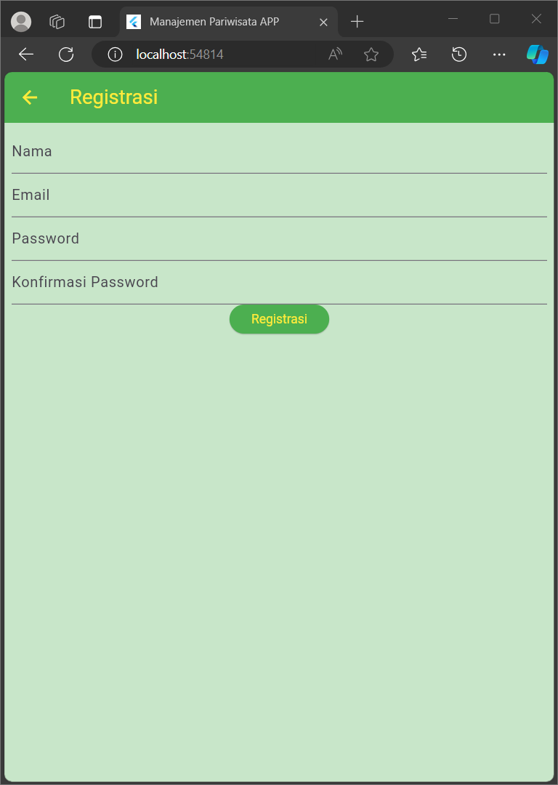
  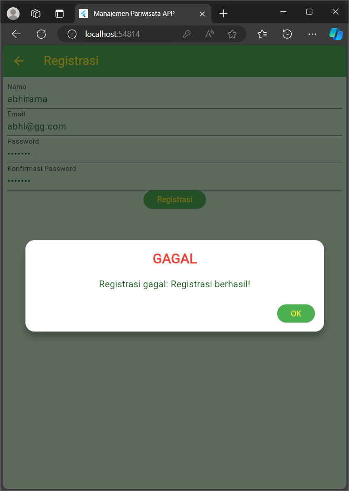
  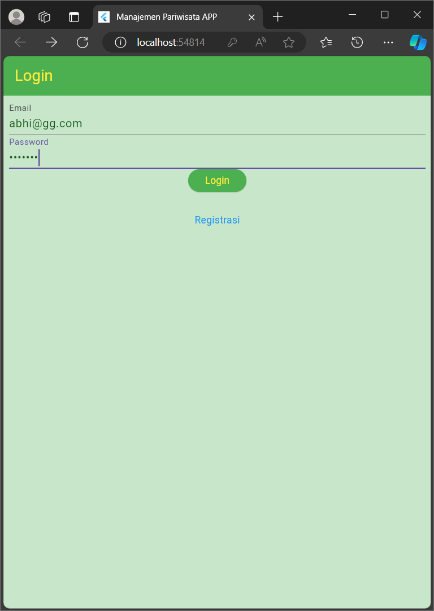
  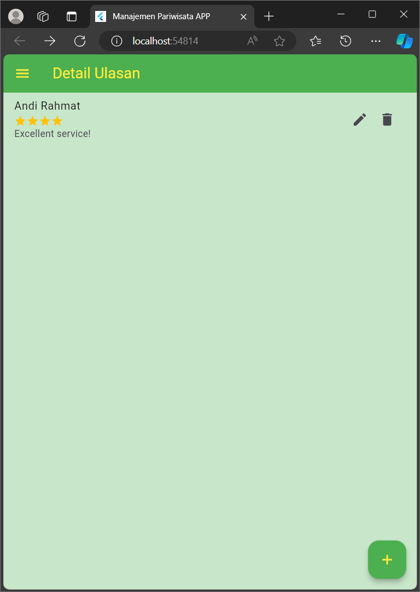
  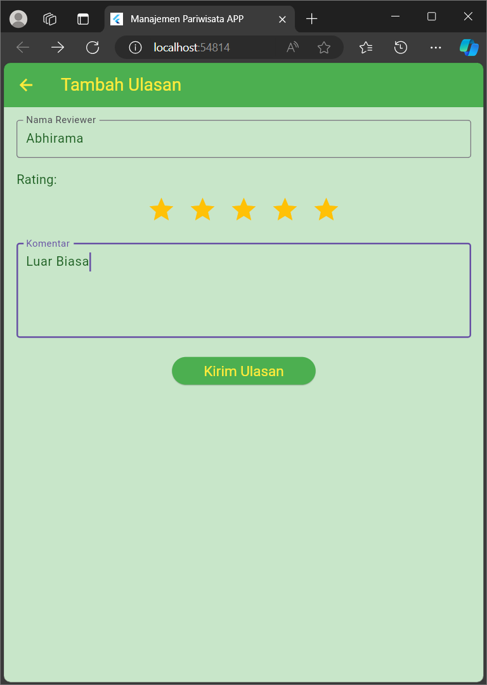
  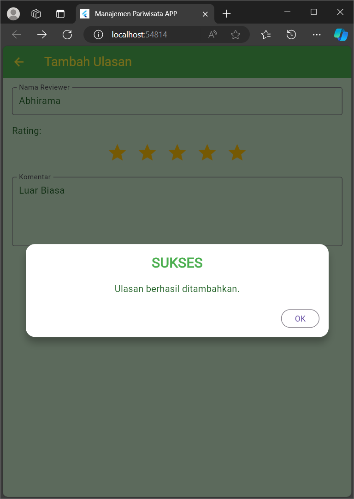
  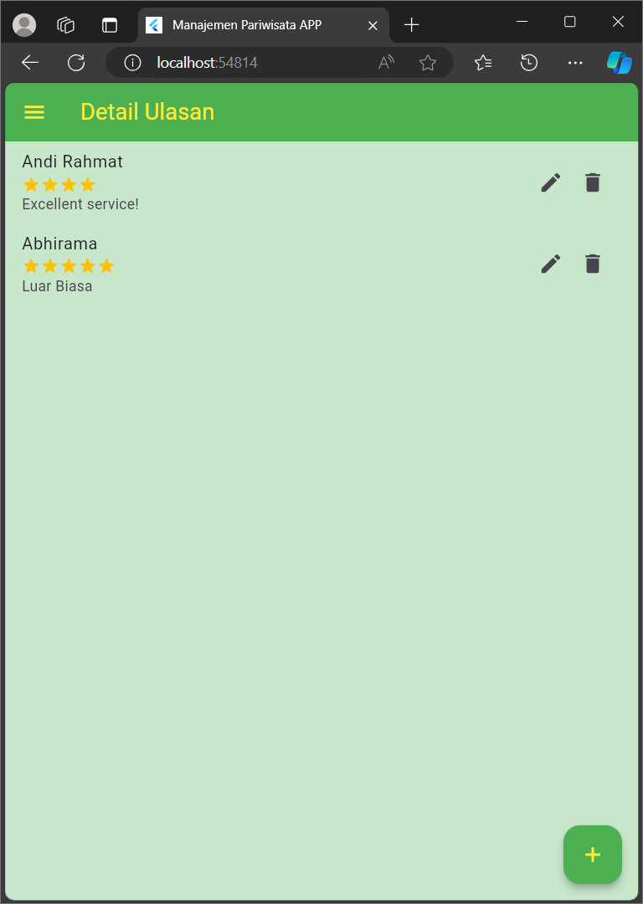
  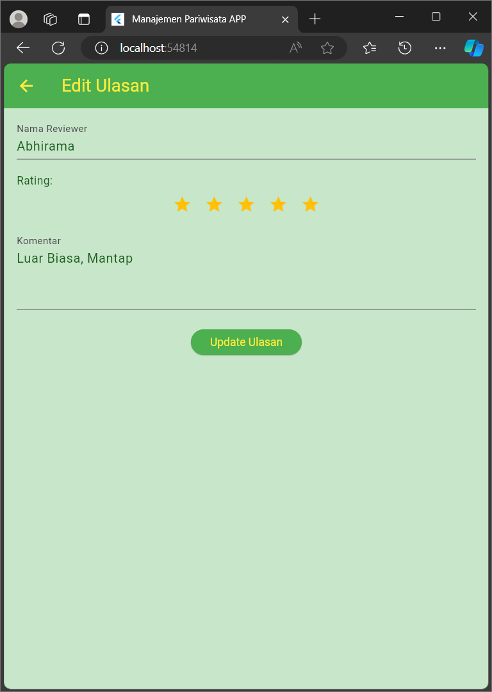
  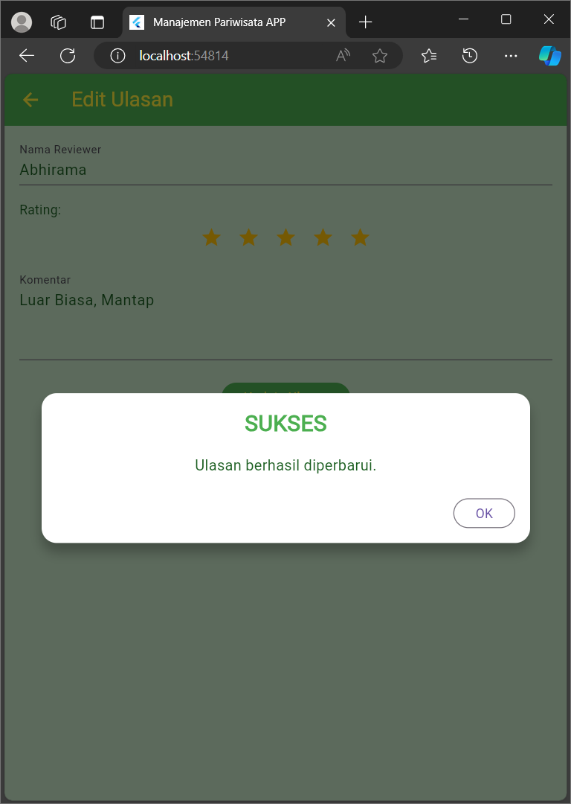
  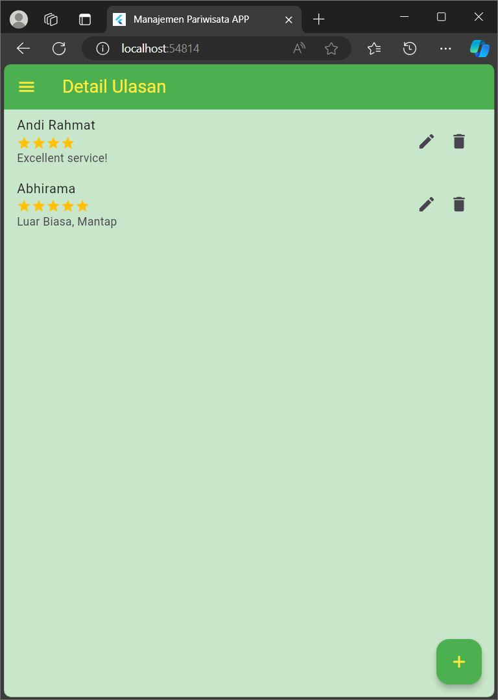
  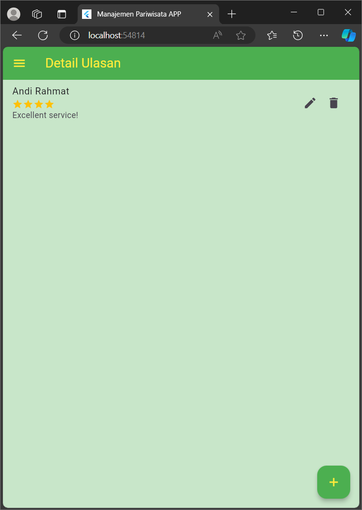
  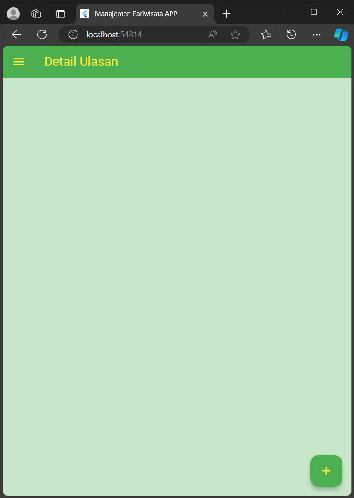
  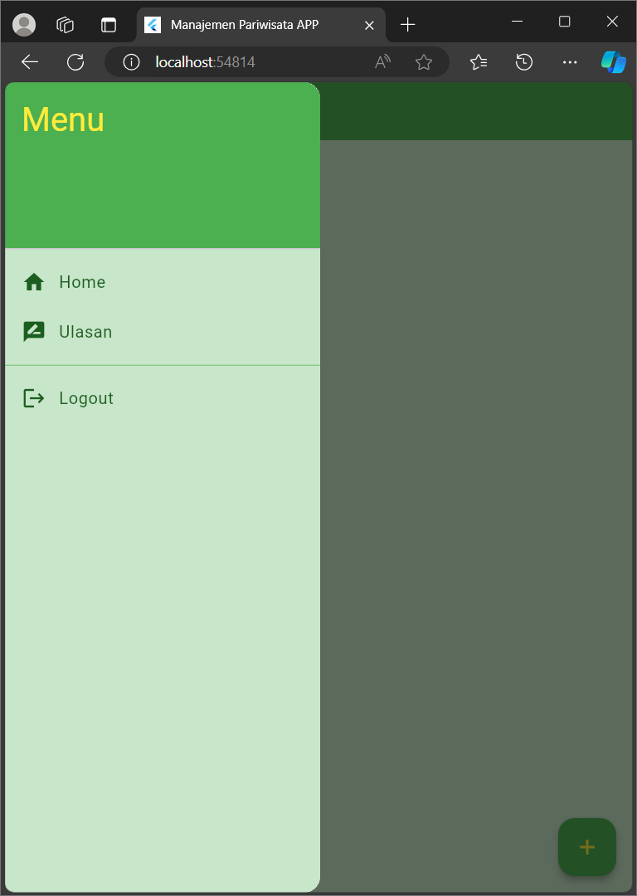
</div>